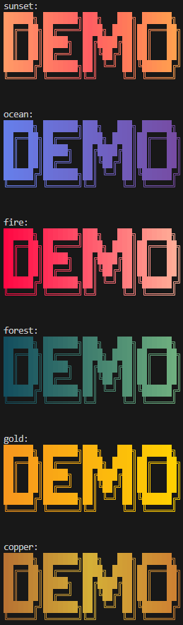
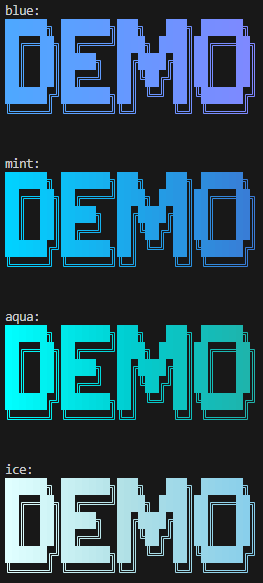
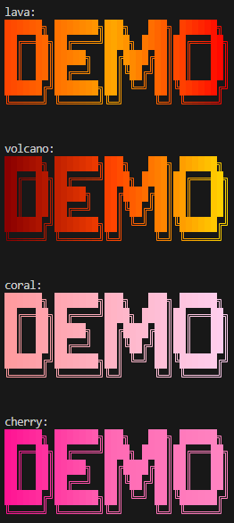
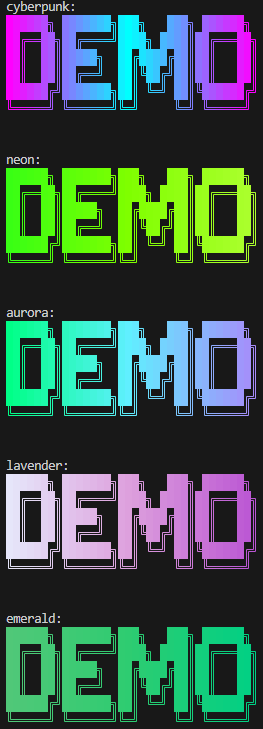
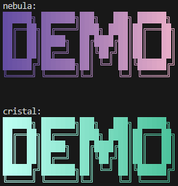
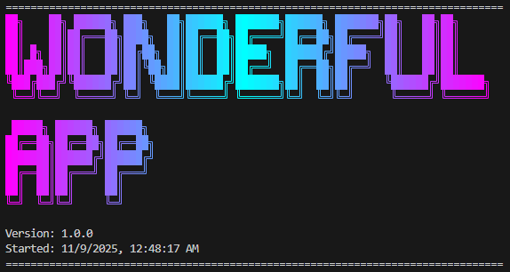
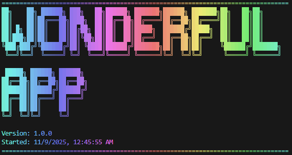

# CLI ASCII Logo

Create beautiful ASCII art logos with gradient colors for your CLI applications.

## Installation

```bash
npm install cli-ascii-logo
```

## Quick Start

```typescript
import logo from "cli-ascii-logo";

// Simple usage with default gradient
console.log(logo.createLogo("Hello"));

// Use a specific gradient
console.log(logo.createLogo("My App", "rainbow"));

// Random gradient
console.log(logo.createRandomLogo("Surprise!"));
```

## API Reference

### Simple Methods

#### `createLogo(text: string, palette?: PaletteName): string`

Create a logo with a single call.

```typescript
logo.createLogo("MyApp", "sunset");
```

#### `createRandomLogo(text: string): string`

Create a logo with a random gradient palette.

```typescript
logo.createRandomLogo("Lucky");
```

### Builder Pattern (Advanced)

For more control, use the fluent builder API:

```typescript
logo.setText("MyApp").addFontStyle("ANSI Shadow", 120).build("ocean");
```

#### Methods

- **`setText(text: string): this`** - Set the text for the logo
- **`addFontStyle(font?: figlet.Fonts, width?: number): this`** - Apply ASCII art font
- **`build(palette?: PaletteName): string`** - Build and return the final logo
- **`addGradient(palette: PaletteName): string`** - Apply gradient and return (alternative to build)
- **`addRandomGradient(): string`** - Apply random gradient and return

## Available Gradients

### Custom Gradients

**Classic & Popular:**

- `sunset` - Warm orange to red (default)
- `ocean` - Deep blue to purple
- `fire` - Bold red to pink
- `forest` - Teal to green
- `gold` - Orange to yellow
- `copper` - Metallic bronze



**Cool Tones:**

- `blue` - Bright blue gradient
- `mint` - Cyan to blue
- `aqua` - Turquoise tones
- `ice` - Icy white-blue tones



**Warm Tones:**

- `lava` - Hot reds and oranges
- `volcano` - Dark red to gold
- `coral` - Soft pink gradient
- `cherry` - Pink-red



**Vibrant & Modern:**

- `cyberpunk` - Neon pink-cyan
- `neon` - Radioactive green
- `aurora` - Northern lights effect
- `lavender` - Soft purples
- `emerald` - Northern lights effect



**Special Effects:**

- `matrix` - Classic terminal green
- `nebula` - Purple to pink space



### Preset Gradients

From the `gradient-string` library: `cristal`, `teen`, `mind`, `morning`, `vice`, `passion`, `fruit`, `instagram`, `atlas`, `retro`, `summer`, `pastel`, `rainbow`

You can get the list programmatically:

```typescript
import { PALETTE_NAMES } from "cli-ascii-logo";

console.log(PALETTE_NAMES); // Array of all available palette names
```

## TypeScript Support

Full TypeScript support with exported types:

```typescript
import logo, {
  PaletteName,
  PALETTE_NAMES,
  CUSTOM_GRADIENTS,
} from "cli-ascii-logo";

const palette: PaletteName = "sunset";
```

## Examples

### Basic Example

```typescript
import logo from "cli-ascii-logo";

console.log(logo.createLogo("Welcome", "rainbow"));
```

### Builder Pattern Example

```typescript
import logo from "cli-ascii-logo";

const myLogo = logo.setText("MyApp").addFontStyle("ANSI Shadow").build("ocean");

console.log(myLogo);
```

### Show All Palettes

```typescript
import logo, { PALETTE_NAMES } from "cli-ascii-logo";

PALETTE_NAMES.forEach((palette) => {
  console.log(`\n--- ${palette} ---`);
  console.log(logo.createLogo("Logo", palette));
});
```

### Rich Application Banner

Create a full banner with metadata (version, timestamp, etc.):

```typescript
import logo from "cli-ascii-logo";
import fs from "fs";

function printAppBanner() {
  const pkg = JSON.parse(fs.readFileSync("./package.json", "utf-8"));
  const logoText = logo.createLogo("wonderful\napp", "cyberpunk");

  const banner = [
    "=".repeat(80),
    logoText,
    `Version: ${pkg.version}`,
    `Started: ${new Date().toLocaleString()}`,
    "=".repeat(80),
  ].join("\n");

  console.log(banner);
}

printAppBanner();
```


You can also apply gradients to the entire banner:

```typescript
function printColoredBanner() {
  const pkg = JSON.parse(fs.readFileSync("./package.json", "utf-8"));
  const logoText = logo.setText("wonderful\napp").addFontStyle().getText();

  const bannerText = [
    "=".repeat(80),
    logoText,
    `Version: ${pkg.version}`,
    `Started: ${new Date().toLocaleString()}`,
    "=".repeat(80),
  ].join("\n");

  // Apply gradient to the entire banner
  console.log(logo.setText(bannerText).addRandomGradient());
}

printColoredBanner();
```



## Dependencies

- [figlet](https://www.npmjs.com/package/figlet) - ASCII art text generation
- [gradient-string](https://www.npmjs.com/package/gradient-string) - Gradient color effects

## License

MIT

## Contributing

Contributions welcome! Please open an issue or PR on GitHub.
